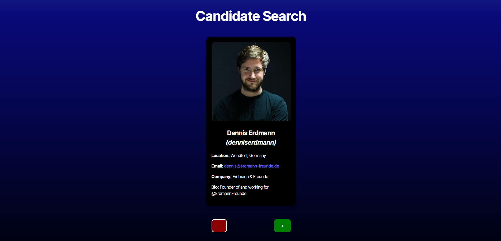
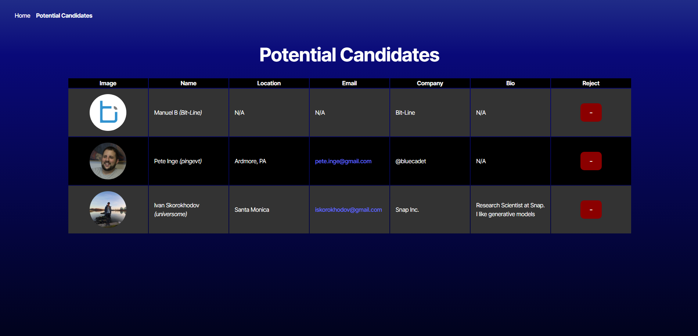

# Candidate Search

## Description
The Candidate Search project allows users to browse different GitHub profiles for potential job candidates, retrieved using the GitHub API and rendered in the browser. While browsing, users can either reject GitHub users or accept them as potential candidates. Accepted candidates will be stored in local storage, and users can review them in a table in the "Potential Candidates" section. If a user changes their mind about an accepted candidate, they can reject the candidate within this section, which removes them from local storage.

## Table of Contents
- [Installation](#installation)
- [Usage](#usage)
- [Contributing](#contributing)
- [Tests](#tests)
- [Questions](#questions)

## Installation
There are multiple ways that users can "install" the Candidate Search application for their use. First, they may download the Candidate Search source code from GitHub and run it locally (https://github.com/dolaes/Candidate-Search). After downloading the repository, users must run `npm i` to install the necessary packages, input their personal GitHub API key into the `.env` file, then run `npm run preview` to deploy the Candidate Search locally. Alternatively, users can simply visit the public deployment link at (https://candidate-search-xkay.onrender.com/).

## Usage
On the Candidate Search homepage, users are shown GitHub user profiles one at a time, including the user's profile picture, name, username, location, email, company, and bio. Using the red "-" button or the green "+" button, users can choose to reject or accept the shown profiles. After making a selection, the next profile will be displayed. If a user rejects a profile, the program simply moves to the next one. If a user accepts a profile, the program saves the potential candidate to local storage before proceeding. After browsing enough profiles, users can visit the "Potential Candidates" page to view the accepted candidates in a table format. If users change their mind about an accepted candidate, they can click the red "-" button next to the candidate's row to remove them from local storage.

## Contributing
Starter code provided by UCI Software Engineering Boot Camp. Developed by Daniel Olaes.

## Tests
To test the application, users can browse the profiles to ensure valid profiles are displayed (profiles not found by the API call are skipped). Next, they can accept some profiles and use web development tools to confirm that the accepted profiles are stored in local storage. Additionally, by navigating to the "Potential Candidates" page, stored candidates should appear in the table. Lastly, when a potential candidate is rejected, users can verify using web development tools that the candidate is removed from local storage.

## Questions
For questions, feel free to reach out at:
- GitHub: [dolaes](https://github.com/dolaes)
- Email: [danielolaes18@gmail.com](mailto:danielolaes18@gmail.com)
